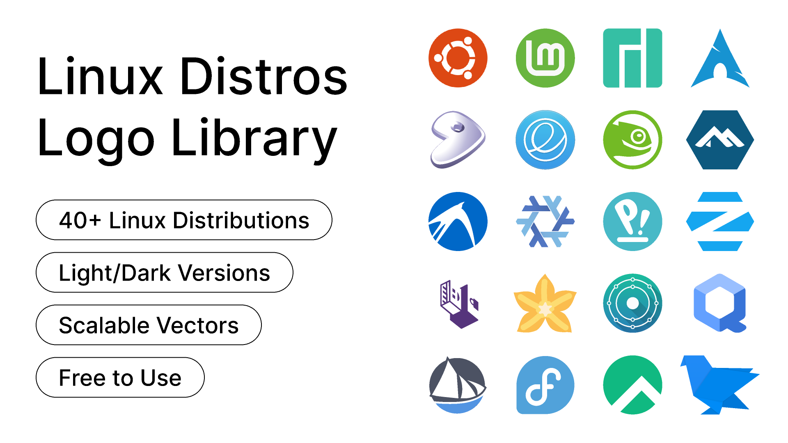

# Document 1
# Linux Operating System

## What is Linux?

Linux is an operating system, similar to Windows and macOS. It manages the hardware resources of a computer and allows software to communicate with the hardware.

Linux is used on many different types of devices, including desktops, servers, smartphones, cars, televisions, and other systems.

## Components of Linux

The Linux operating system is made up of several different components:

1. Bootloader
2. Kernel
3. Init system
4. Daemons
5. Graphical server
6. Desktop environment
7. Applications

The kernel is the core of the system and manages resources such as the CPU, memory, and peripheral devices. :contentReference[oaicite:1]{index=1}

## Why Use Linux?

Linux is known for being reliable and is available without the software licensing costs associated with some other operating systems.

Some reasons people use Linux include:

- Reliability
- Security
- Flexibility
- Free and open-source software
- Many different distributions to choose from

## Open Source

Linux is distributed under an open source model. Users have the freedom to run the software, study how it works, modify it, and redistribute copies and modified versions.

This allows developers and communities around the world to contribute to Linux. :contentReference[oaicite:2]{index=2}

## Linux Distributions

Linux has many different versions called distributions, or "distros." Each distribution can have different software, desktop environments, and features.

Some popular Linux distributions include:

- Ubuntu
- Debian
- Fedora
- Linux Mint
- Manjaro
- openSUSE
- Elementary OS

## Linux Distribution Comparison

| Distribution | Description | Desktop Environment |
|---|---|---|
| Ubuntu | [Description] | [Desktop Environment] |
| Debian | [Description] | [Desktop Environment] |
| Fedora | [Description] | [Desktop Environment] |
| Linux Mint | [Description] | [Desktop Environment] |

## Linux Mascot


## Linux Distribution Logos




# Document 2

## Learn the Basics

### Hello, World!

The `print()` function is used to display text on the screen.

```python
print("Hello, World!")
```

### Variables and Types

Variables store information. Python has different types such as strings, integers, floats, and booleans.

```python
my_string = "Hello"
my_int = 10
my_float = 10.5
my_boolean = True

print(my_string)
print(my_int)
print(my_float)
print(my_boolean)
```

### Lists

Lists are used to store multiple items in one variable. Items in a list can be accessed by their position.

```python
my_list = [1, 2, 3]
print(my_list)
print(my_list[0])
```

### Basic Operators

Python uses operators to perform mathematical calculations and comparisons.

```python
number = 10

print(number + 5)
print(number - 5)
print(number * 5)
print(number / 5)
```

### String Formatting

String formatting allows variables to be placed inside strings.

```python
name = "John"
print("Hello, %s!" % name)
```

### Basic String Operations

Python provides different operations for working with strings.

```python
text = "Hello World"

print(len(text))
print(text.index("World"))
print(text.count("l"))
print(text.upper())
print(text.lower())
```

### Conditions

Conditions allow Python programs to make decisions using `if`, `elif`, and `else`.

```python
number = 10

if number > 5:
    print("The number is greater than 5")
else:
    print("The number is 5 or less")
```

### Loops

Loops allow you to repeat a section of code. A `for` loop can be used to go through items in a sequence.

```python
primes = [2, 3, 5, 7]

for prime in primes:
    print(prime)
```

# Document 3

## Table 1

| Id  | Name            | Email                    | Investments          |
|-----|-----------------|--------------------------|-----------------------|
| 231 | Albert Master   | albert.master@gmail.com  | Bonds                 |
| 210 | Alfred Alan     | aalan@gmail.com          | Stocks                |
| 256 | Alison Smart    | asmart@biztalk.com       | Residential Property |
| 211 | Ally Emery      | allye@easymail.com       | Stocks                |
| 248 | Andrew Phips    | andyp@mycorp.com         | Stocks                |
| 234 | Andy Mitchel    | andym@hotmail.com        | Stocks                |
| 226 | Angus Robins    | arobins@robins.com       | Bonds                 |
| 241 | Ann Melan       | ann_melan@iinet.com      | Residential Property |
| 225 | Ben Bessel      | benb@hotmail.com         | Stocks                |
| 235 | Bensen Romanolf | benr@albert.net          | Bonds                 |
| Id  | Name            | Email                    | Investments          |
|-----|-----------------|--------------------------|-----------------------|
| 231 | Albert Master   | albert.master@gmail.com  | Bonds                 |
| 210 | Alfred Alan     | aalan@gmail.com          | Stocks                |
| 256 | Alison Smart    | asmart@biztalk.com       | Residential Property |
| 211 | Ally Emery      | allye@easymail.com       | Stocks                |
| 248 | Andrew Phips    | andyp@mycorp.com         | Stocks                |
| 234 | Andy Mitchel    | andym@hotmail.com        | Stocks                |
| 226 | Angus Robins    | arobins@robins.com       | Bonds                 |
| 241 | Ann Melan       | ann_melan@iinet.com      | Residential Property |
| 225 | Ben Bessel      | benb@hotmail.com         | Stocks                |
| 235 | Bensen Romanolf | benr@albert.net          | Bonds                 |